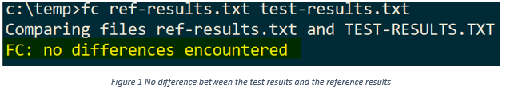

# Lab01: A Toy Lottery Game

## 1. Description
This toy lottery game is played in command prompt window. It randomly generates 4 digits, there could be duplicate digits. Then you are asked to guess those 4 digits. It has 9 single letter commands now. These commands are

```batch
Welcome to the lottery game!
============================
The game starts asking for a command:
        h: show this help information
        n: start a new game
        p: print lottery results
        o: sort the awards in decreasing order
        d: display the statistics about the awards
        t: test the program
        s: save lotteries played
        l: load lotteries played
        q: quit the game
```

## 2. Objectives
Practice programming paradigms of C++ arrays:
1. iterate an array
2. find the maximum/minimum value of a number array
3. find the sum/average/standard deviation of a number array
4. sort a number array
5. write module code for a given program
6. test user code and given framework code together

## 3. Tasks 

1. (10%) Play with the game, try each command. Take a screenshot of the output of each command your played.
   1. Copy test-records.txt and ref-results.txt to your project folder before you run this lottery game in Visual Studio
   2. Copy test-records.txt and ref-results.txt to the folder containing your lottery.exe before you run this lottery game in command prompt
2. (80%, 20% for each) Complete the 4 TODOs in lottery.cpp
   1. Take a screenshot of the implementation of each TODO
   2. Explain your code
3. (10%) Test your implementation using the t command
   1. Copy test-records.txt and ref-results.txt to the folder containing your lotter.exe before you run this lottery game in command prompt
   2. run the t command to test your implementation automatically and generate a test-results.txt
   3. then compare your test-results.txt with the ref-results.txt, you may use command fc:
   ```batch
   fc test-results.txt ref-results.txt
   ```
   If everything is right, there should be NO difference between these two files. 

   

**Note**

* The report must record all the tasks below into section 2 "Steps of the process" of the provided lab report template
* Each screenshot and table must have a caption, refer to [Insert a caption for a picture](https://support.microsoft.com/en-us/office/insert-a-caption-for-a-picture-bb74994c-7f8b-457c-be85-92233177a356)

## 4. What to submit
1. Rename your lottery.cpp to be your FirstName_LastName_lottery.cpp
2. A lab report with screenshots that show you completed all tasks
## 5. Rubrics

1. Rubrics used: check its detail on Canvas
   1. 80% for code
   2. 20% for report
2. reference rubrics

| Credits | Criteria |
| ------- | -------- |
| 0% | Source code files were not provided.<br> Problem solution was not submitted. |
| 25% | Significant assignment requirements were ignored or violated.<br>Program doesn’t compile. |
| 50% | Output of the program was not shown.<br> Lack of comments.<br> Pour code readability (inconsistent indentation, variable naming, general organization) |
| 75% | Choosing a poorly approach to solve a problem, for example, solving a problem with hard coding instead of using a loop.<br> Minor details of the program specifications were violated. |
| 100% | Program works correctly and meets the requirements of the assignment. <br> Code is clean, well-organized, and well commented. |


